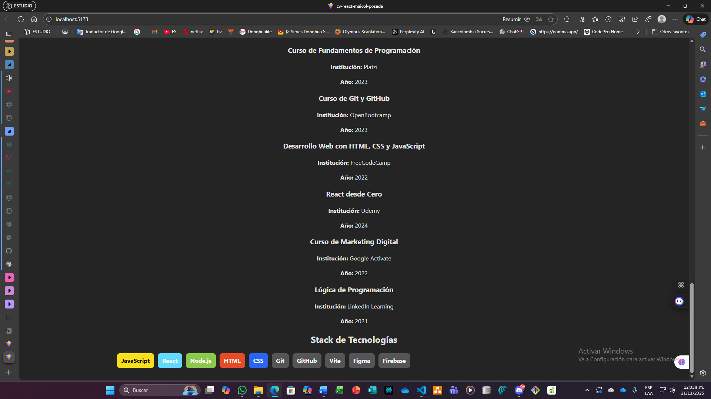
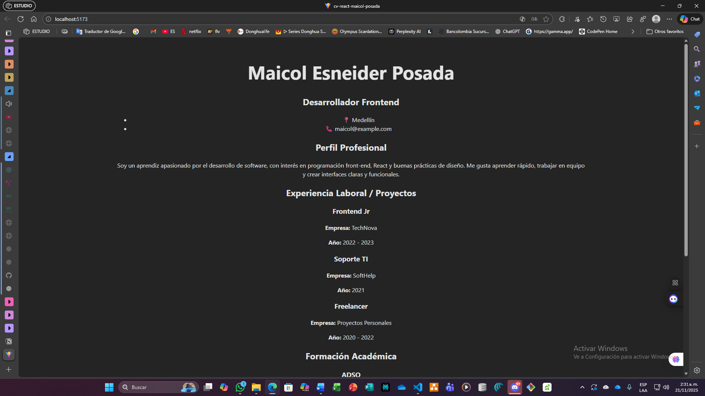
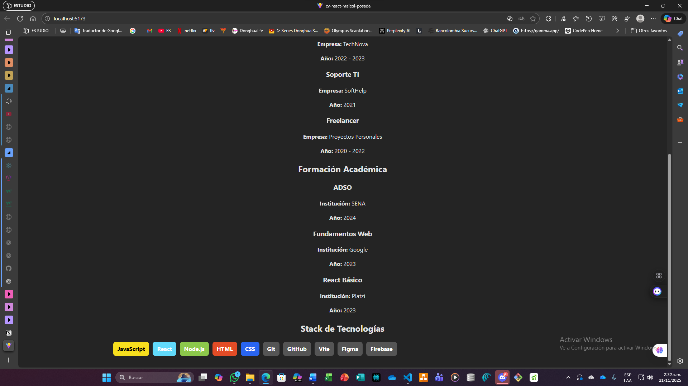

CV React – Maicol Posada

Descripción del proyecto
Este proyecto corresponde al desarrollo de una hoja de vida creada con React y Vite. El objetivo es aplicar la estructura modular de componentes, el uso de importaciones y la organización del proyecto siguiendo buenas prácticas. Además, se manejó el control de versiones utilizando Git y GitHub, con un commit por cada componente solicitado en la actividad.

1. Ejecución del Proyecto

1.1. Instalación del repositorio
Clona el repositorio en tu equipo:

git clone <URL-DE-TU-REPOSITORIO>

1.2. Ingresar al proyecto

cd cv-react-maicol-posada

1.3. Instalar dependencias

npm install

1.4. Ejecutar el servidor de desarrollo

npm run dev

El proyecto estará disponible en:
http://localhost:5173/

2. Componentes del Proyecto

El proyecto está compuesto por los siguientes componentes, cada uno creado y subido con su respectivo commit individual:

CabeceraCV.jsx: contiene la información personal básica.

Perfil.jsx: incluye la descripción del perfil profesional y habilidades.

Experiencia.jsx: muestra cuatro experiencias laborales o proyectos.

Educacion.jsx: contiene la formación académica y cursos realizados.

App.jsx: integra y organiza todos los componentes para visualizarlos en pantalla.

3. Lista de Commits Realizados

feat: componente CabeceraCV con datos personales actualizados

feat: componente Perfil con descripción personalizada

feat: componente Experiencia con 4 cargos definidos

feat: componente Educacion con formación complementaria

feat: integración de todos los componentes del CV en App.jsx

fix: corrección de App.jsx eliminando función duplicada

docs: README del proyecto CV React añadido

4. Captura del Proyecto

5. Tecnologías Utilizadas

React

Vite

JavaScript

Git

GitHub

6. Conclucion 

El desarrollo de este proyecto permitió aplicar de manera práctica conceptos fundamentales de React, especialmente la creación y organización de componentes. También se fortaleció el uso de Git y GitHub para el control de versiones, garantizando un trabajo ordenado y con trazabilidad. Esta actividad sirve como base para continuar con ejercicios más avanzados en las siguientes guías, asegurando un aprendizaje progresivo y bien estructurado.

README – EV06: Componentes Dinámicos en React

Proyecto: cv-react-maicol-posada

1. Descripción del ejercicio

En esta actividad se desarrollaron componentes dinámicos utilizando renderizado condicional y renderizado de listas en React. El objetivo principal fue construir secciones del currículum (CV) digital que respondieran al contenido del arreglo de datos y a condiciones lógicas del programa, reforzando el manejo del método map(), operadores ternarios y estilos aplicados según las tecnologías.

El enfoque del ejercicio se centra en la construcción de una interfaz organizada, modular y fácil de escalar. Cada componente fue creado siguiendo buenas prácticas y registrando su avance mediante commits descriptivos en GitHub.

2. Componentes creados en esta evidencia
2.1. Experiencia.jsx

Se creó un arreglo con 10 experiencias laborales y proyectos.

Cada item contiene:

Cargo

Empresa

Año

Descripción breve

Se implementó renderizado dinámico con .map().

2.2. Educacion.jsx

Se construyó un arreglo con estudios, cursos, talleres y formaciones complementarias.

Cada elemento incluye:

Institución

Nombre del curso

Año

Renderizado dinámico mediante listas.

2.3. StackTecnologias.jsx

Se replicó el ejemplo del tutorial visto en clase.

Cada tecnología se representa con una etiqueta estilizada, que cambia de color según la categoría o tipo.

Se aplicó:

Renderizado condicional

Estructura visual organizada

Listas generadas con .map()

3. Instrucciones para ejecutar el proyecto

Para visualizar el proyecto en tu entorno local:

Clonar el repositorio:

git clone https://github.com/tu-usuario/cv-react-maicol-posada.git

Instalar dependencias:

npm install

Ejecutar el proyecto:

npm run dev

Abrir el navegador y acceder a:

http://localhost:5173/

4. Captura del resultado final

5. Conclusión

Esta evidencia permitió fortalecer la comprensión del renderizado condicional y la generación dinámica de contenido en React. El desarrollo de los componentes a partir de arreglos y la integración de estilos condicionales aportó una estructura más organizada, escalable y profesional al CV digital.
Además, la práctica constante con Git y GitHub garantizó una correcta trazabilidad del código y del proceso de construcción.

README – EV07: Reutilización de Componentes en React con Props y Desestructuración

Proyecto: cv-react-maicol-posada

1. Descripción del ejercicio

En esta actividad se amplió el proyecto del CV digital construido anteriormente, integrando el uso de props y desestructuración para convertir los componentes en elementos reutilizables, dinámicos y más profesionales. El objetivo principal fue centralizar la información del currículum en un archivo independiente (cvData.js) y enviar estos datos como propiedades hacia cada componente del proyecto.

Este enfoque permite mejorar la escalabilidad, el orden y la mantenibilidad del código, facilitando la separación de responsabilidades y el uso correcto de la arquitectura recomendada en React.

2. Componentes actualizados con Props

Durante la actividad se implementaron cuatro componentes principales que ahora reciben su información desde App.jsx mediante props:

2.1. CabeceraCV.jsx

Recibe:

nombre

cargo

ciudad

contacto

Se aplicó desestructuración directamente en los parámetros.

2.2. Perfil.jsx

Recibe:

resumen

Se implementó un componente limpio y reutilizable.

2.3. Experiencia.jsx

Recibe:

lista (arreglo con experiencias laborales y proyectos)

Se trabajó con el método .map() para mostrar dinámicamente cada experiencia.

2.4. Educacion.jsx

Recibe:

lista (arreglo con estudios, cursos y formaciones)

Implementación dinámica con desestructuración de props.

2.5. StackTecnologias.jsx (del EV06 pero adaptado también a props)

Recibe:

lista con tecnologías.

Se conservaron los estilos condicionales para diferenciar cada tecnología por color.

3. Estructura del Proyecto

Los datos del CV se almacenan en el archivo:

src/cvData.js

Y son importados en App.jsx, donde se envían como props a cada componente.

Esto mejora la organización y evita tener datos “quemados” dentro de los componentes.

4. Instrucciones para ejecutar el proyecto

Para visualizar el proyecto en tu entorno local:

Clonar el repositorio

git clone https://github.com/tu-usuario/cv-react-maicol-posada.git

Instalar dependencias

npm install

Ejecutar el proyecto

npm run dev

Abrir el navegador en

http://localhost:5173/

5. Capturas de pantalla del proyecto

6. Conclusión

La actividad EV07 permitió estructurar un proyecto React más modular, limpio y escalable. El uso de props y desestructuración facilitó que cada componente cumpliera una única responsabilidad, separando la lógica de los datos y permitiendo una actualización más sencilla del CV.
Además, los commits organizados documentaron el progreso paso a paso, reforzando las buenas prácticas en control de versiones.

7. Autor

Maicol Esneider Posada Callejas
Aprendiz del SENA – ADSO