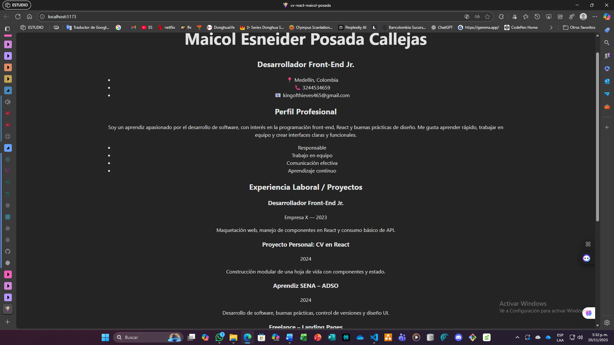
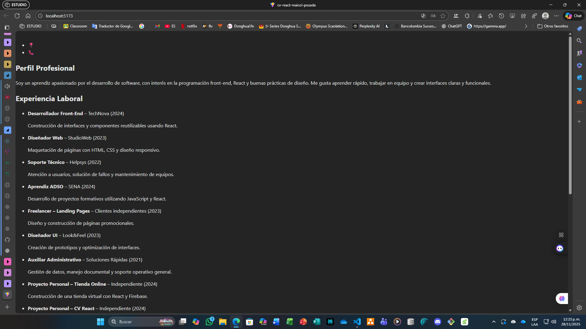
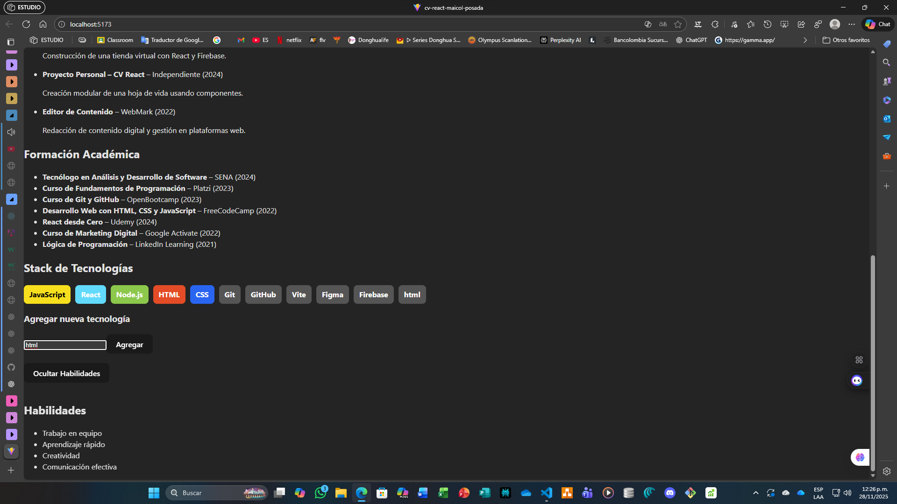

# CV React – Maicol Posada

Este proyecto fue desarrollado utilizando **React** y **Vite**, con el propósito de construir una hoja de vida digital modular, escalable y completamente dinámica.  
Cada evidencia (EV04 – EV08) fue ejecutada siguiendo buenas prácticas de desarrollo y control de versiones.

---

## 1. Descripción General

El proyecto consiste en la creación de una hoja de vida digital aplicando conceptos fundamentales de React.  
A lo largo del desarrollo se implementaron:

- Componentes modulares  
- Props y desestructuración  
- Renderizado condicional  
- Manejo del estado con `useState`  
- Listas dinámicas usando `map()`  
- Eventos y formularios controlados  
- Commits organizados por funcionalidad  

**Objetivo principal:** construir una estructura organizada, clara y adaptable.

---

## 2. Ejecución del Proyecto

2.1. Clonar el repositorio  
```bash
git clone <URL-DE-TU-REPOSITORIO>
2.2. Acceder al proyecto


cd cv-react-maicol-posada
2.3. Instalar dependencias


npm install
2.4. Ejecutar servidor local


npm run dev
2.5. Abrir en el navegador

Código
http://localhost:5173/
```
## 3. Evidencias (EV04 – EV08 y EV09 de diseño por gusto personal)
### 3.1. EV04 – EV05 Estructura inicial del proyecto
Durante esta fase se construyó la base del proyecto y se agregaron los componentes iniciales, cada uno registrado con su respectivo commit.

### Componentes creados:

-CabeceraCV.jsx

-Perfil.jsx

-Experiencia.jsx

-Educacion.jsx

-App.jsx

Estos representan la estructura fundamental del CV.

## Evidencia visual del EV04 - EV05: 




## 3.2. EV06 – Componentes dinámicos
Se implementó el renderizado dinámico mediante arreglos y el método map().

### Componentes desarrollados:

-Experiencia.jsx → contiene diez experiencias laborales o proyectos con renderizado dinámico.

-Educacion.jsx → lista de estudios, cursos y formaciones implementada con map().

-StackTecnologias.jsx → tecnologías mostradas mediante etiquetas estilizadas, con colores asignados según tipo y renderizado condicional.

## Evidencia visual del EV06: 


## 3.3. EV07 – Reutilización mediante Props y Desestructuración
En esta evidencia se reorganizó el proyecto para hacerlo completamente modular mediante el uso de props.

### Actualizaciones realizadas:

-Se creó el archivo cvData.js, encargado de almacenar todos los datos del CV.

-Se enviaron los datos desde App.jsx hacia los componentes mediante props.

-Componentes actualizados:

-CabeceraCV.jsx → recibe nombre, cargo, ciudad y contacto.

-Perfil.jsx → recibe el resumen profesional.

-Experiencia.jsx → recibe una lista de experiencias.

-Educacion.jsx → recibe un arreglo de estudios.

-StackTecnologias.jsx → recibe un arreglo con tecnologías.

## Evidencia visual del EV07: 


## 3.4. EV08 – Interactividad con eventos y manejo de estado
En esta etapa el proyecto se volvió interactivo, incorporando estados locales y globales.

### Funciones agregadas:

-Mostrar y ocultar la sección de habilidades.

-Agregar nuevas tecnologías mediante un formulario controlado.

-Actualización instantánea sin recargar la página.

### Componentes creados:

-ToggleHabilidades.jsx → botón para mostrar/ocultar habilidades.

-Habilidades.jsx → muestra lista de habilidades cuando el estado está activo.

-FormularioTecnologia.jsx → formulario controlado que permite agregar nuevas tecnologías al stack.

-Actualizaciones en App.jsx:

-Implementación de estados mediante useState.

-Funciones agregarTecnologia() y toggleHabilidades().

-Renderizado condicional dinámico.

## Evidencias visuales del EV08: 





## 3.5. EV09 – Actualización de datos y rediseño visual una preferencia personal no espesificada en la guia

En esta evidencia se realizó una **optimización completa del proyecto**, enfocada en:

### Objetivos principales:
- **Actualización de datos reales** en el archivo `cvData.js`:
  - Nombre, cargo, ubicación y correo.
  - Perfil profesional redactado para transmitir confianza.
  - Experiencias laborales, estudios, habilidades y tecnologías relevantes.
- **Rediseño visual futurista**:
  - Aplicación de **glassmorphism**, gradientes y efectos modernos.
  - Paleta oscura con acentos neón.
  - Layout responsivo con Flexbox y Grid.
- **Centrado del contenido y eliminación de bordes blancos** para una visualización más profesional.
- **Responsividad completa** para móviles y tablets.
- **Eliminación del componente `FormularioTecnologia.jsx`**:
  - Se consideró innecesario para una hoja de vida profesional.
  - No cumplía con la guía del proyecto.
  - Se priorizó la simplicidad y la presentación estática.

---

### Actualizaciones realizadas:
- Reorganización de `App.jsx` con estructura semántica.
- Ajustes en `index.css` para:
  - Centrar el contenido.
  - Eliminar bordes blancos.
  - Aplicar diseño futurista.
- Componentes optimizados para recibir datos mediante props.
- Responsividad para pantallas pequeñas y tablets.

---

### Componentes finales:
- **CabeceraCV.jsx** → muestra nombre, cargo, ciudad y correo.
- **Perfil.jsx** → perfil profesional y fortalezas.
- **Experiencia.jsx** → lista de experiencias laborales.
- **Educacion.jsx** → lista de estudios.
- **StackTecnologias.jsx** → tecnologías con chips estilizados.
- **ToggleHabilidades.jsx** → botón para mostrar/ocultar habilidades.
- **Habilidades.jsx** → lista de habilidades destacadas.

---

### Evidencias visuales del EV09:


La evidencia EV09 consolidó el proyecto como una **hoja de vida digital profesional, moderna y responsiva**, cumpliendo con los siguientes objetivos:

- Presentación clara y atractiva.
- Diseño coherente con tendencias actuales.
- Eliminación de funcionalidades innecesarias.
- Preparación del proyecto para ser publicado como portafolio personal.

## 4. Tecnologías Utilizadas
### Tecnología	Usada principalmente 

-React	Construcción de componentes

-JavaScript	Lógica y funciones

-Vite	Entorno de desarrollo rápido

-Git	Control de versiones

-GitHub	Repositorio remoto

-CSS    Diseño y creatividad

## 5. Conclusiones Generales

### El desarrollo de este CV digital permitió:

-Comprender cómo estructurar proyectos React basados en componentes.

-Aplicar props, estado local, renderizado condicional y listas dinámicas.

-Implementar eventos y formularios controlados.

-Construir una interfaz escalable y fácil de mantener.

-Documentar progresivamente el proyecto mediante commits organizados.

-Resultado: este proyecto se convierte en una base sólida para continuar con trabajos más avanzados en React.


## 6. Autor
Maicol Esneider Posada Callejas Aprendiz ADSO – SENA 