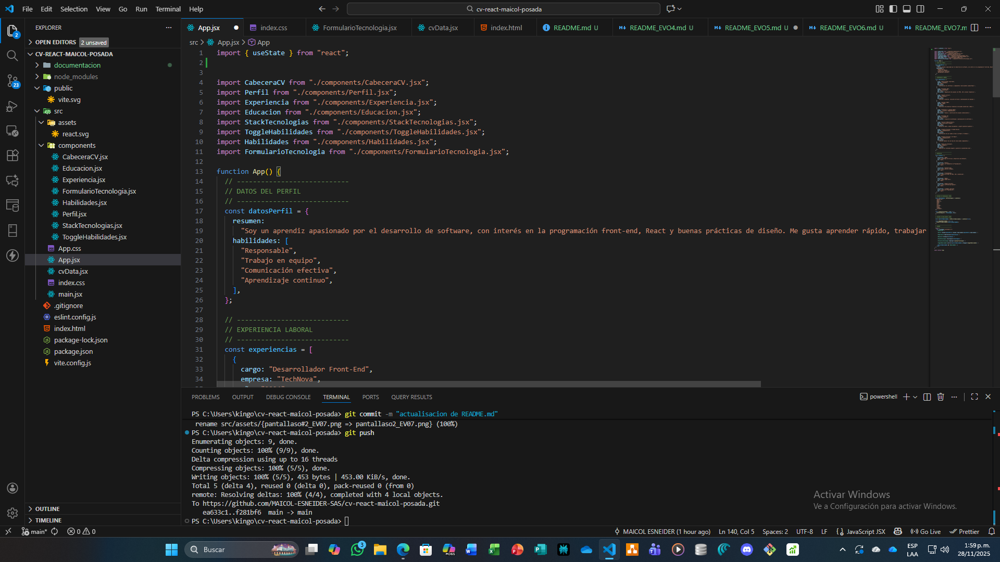
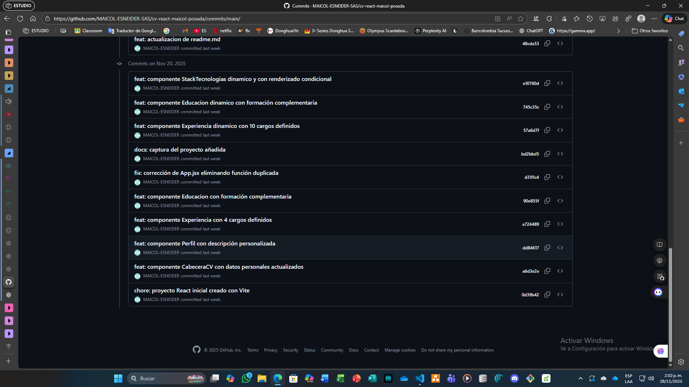

# CV React – Evidencia EV05

**Actividad:** GA1-220501096-03-AA1-EV05  
**Tema:** Buenas prácticas con Git, GitHub y estructura del proyecto  
**Aprendiz:** Maicol Esneider Posada Callejas  
**Programa:** ADSO – SENA  

---

## Descripción de la Evidencia

En la EV05 se reforzó el uso de control de versiones en GitHub, garantizando una estructura clara, organizada y profesional del proyecto React iniciado en la EV04.

**Objetivos principales:**
- Mantener un repositorio correctamente estructurado.
- Documentar el proceso de desarrollo con commits descriptivos.
- Organizar los componentes y archivos del proyecto.
- Crear un archivo README inicial que explique el funcionamiento del proyecto.

Esta evidencia se centra en la correcta administración del repositorio, la limpieza del código y la gestión adecuada de los cambios realizados.

---

## Organización del Proyecto

Durante esta evidencia se revisó y reforzó la estructura de carpetas dentro del proyecto:

### 2.1 Carpeta `src`
Contiene los archivos principales del proyecto, incluyendo:
- `App.jsx`
- `main.jsx`
- `cvData` (si aplica según la estructura)
- `styles` o `assets`
- Carpeta `components` (con los componentes creados en EV04)

### 2.2 Carpeta `components`
Cada componente se mantuvo organizado, con nombres estandarizados y extensión `.jsx`, facilitando la escalabilidad del proyecto.

### 2.3 Archivos estáticos
Las imágenes para las evidencias (pantallazos) se almacenaron dentro de:
```

documentacion/img/

```

---

## Git y GitHub en la EV05

La evidencia exigía demostrar dominio en control de versiones. Por ello se aplicaron:

### 3.1 Commits claros y atómicos
Cada cambio importante se registró mediante un commit independiente y descriptivo.

**Ejemplos:**
- `feat: componente CabeceraCV creado`
- `feat: estructura base de componentes añadida`
- `fix: correcciones en App.jsx y rutas`
- `docs: creación del README inicial`
- `chore: organización del proyecto y limpieza de código`

### 3.2 Subida del proyecto a GitHub
Se verificó que el repositorio contara con:
- Código organizado
- Historial de commits completo
- README visible desde la raíz del repositorio
- Carpetas correctamente sincronizadas

---

## README Inicial del Proyecto

Como parte de la EV05, se incluyó un README básico con:
- Descripción del proyecto
- Pasos para clonar e instalar
- Explicación de estructura
- Mención de los componentes creados

Más adelante, en EV06, EV07 y EV08, este README será ampliado con características, imágenes, capturas y avances.

---

## Capturas de Evidencia EV05

**Estructura del proyecto en Visual Studio Code:**



**Histórico de commits EV05:**



---

## Conclusión de la EV05

La evidencia EV05 permitió fortalecer el uso de Git y GitHub como herramientas esenciales en el desarrollo profesional de software. Gracias a esta práctica:
- Se obtuvo una estructura bien organizada del proyecto.
- Se documentó correctamente cada avance mediante commits.
- Se dejó una base sólida que garantiza trazabilidad, orden y claridad.
- Se estableció una buena práctica que será útil en evidencias posteriores.
