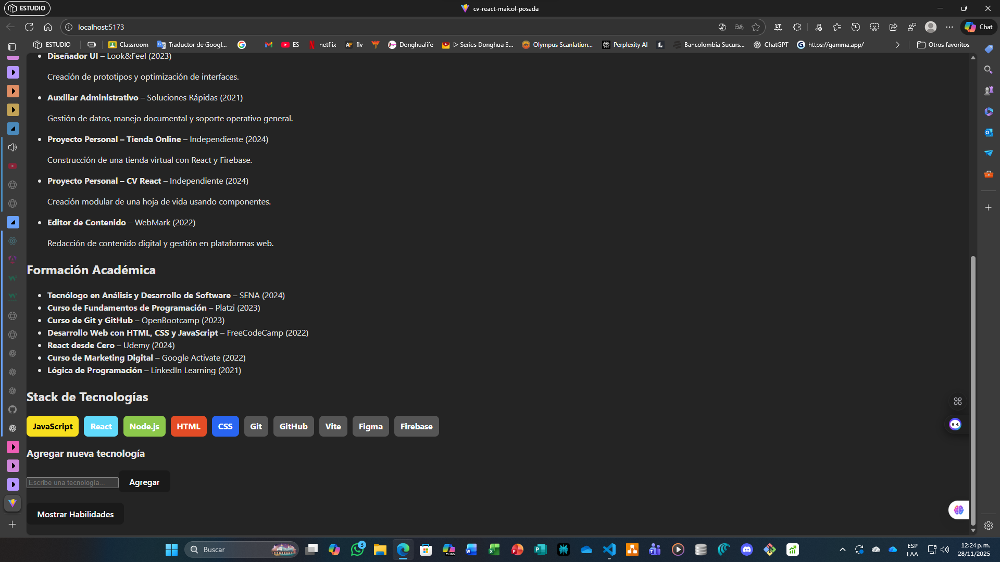

# CV React – Evidencia EV08

**Actividad:** GA1-220501096-03-AA1-EV08  
**Tema:** Manejo de estado e interactividad con React (useState y eventos)  
**Aprendiz:** Maicol Esneider Posada Callejas  
**Programa:** ADSO – SENA  

---

## Descripción de la Evidencia

En esta evidencia se incorporó interactividad al proyecto de hoja de vida implementado en las actividades anteriores. El propósito fue integrar **eventos**, **estados locales**, **renderizado condicional** y **formularios controlados**, permitiendo que la aplicación responda de manera dinámica a la interacción del usuario.

Las mejoras realizadas fortalecen el uso práctico de `useState`, así como la comunicación entre componentes mediante props para actualizar la interfaz sin recargar la página. Esto convierte el CV en una aplicación completamente reactiva.

---

## Funcionalidades Implementadas

### 2.1 Visualizar u ocultar la sección de habilidades
- Se creó el componente `ToggleHabilidades.jsx` con un botón que permite alternar entre mostrar y ocultar la sección de habilidades.
- Props utilizadas:
  - `mostrar`
  - `onToggle`
- La sección `Habilidades.jsx` aparece únicamente cuando la propiedad `mostrar` está activa, aplicando renderizado condicional.

### 2.2 Formulario dinámico para agregar tecnologías
- Componente `FormularioTecnologia.jsx`:
  - Formulario controlado con estado interno.
  - Entrada de texto controlada.
  - Evento `onChange` para actualizar el estado.
  - Evento `onSubmit` para agregar el nuevo dato.
  - Limpieza automática del campo al enviar.
- Al enviar la tecnología, esta se agrega automáticamente al arreglo de tecnologías en `App.jsx` y se muestra en pantalla sin recargar la página.

### 2.3 Actualización dinámica del stack de tecnologías
- Componente `StackTecnologias.jsx` actualizado para recibir el arreglo de tecnologías como props.
- Uso de:
  - Renderizado con `map()`.
  - Estilos condicionales según tipo de tecnología.
- Cada vez que se agrega una nueva tecnología desde el formulario, aparece directamente en esta sección.

### 2.4 Manejo de estado en `App.jsx`
- Se incorporaron dos estados:
  - **Estado de tecnologías**: almacena y actualiza las tecnologías del CV mediante la función `agregarTecnologia()`.
  - **Estado para mostrar habilidades**: controla la visibilidad de la sección `Habilidades.jsx`.
- Ambos estados se comparten con componentes secundarios mediante props.

---

## Instrucciones para Ejecutar el Proyecto

```bash
# 1. Instalar dependencias
npm install

# 2. Ejecutar el proyecto
npm run dev
```

Abrir en el navegador:  
<http://localhost:5173/>

***

## Evidencias de Funcionamiento

**Formulario funcionando:**  


**Botones Abrir/Cerrar:**  



**Habilidades y nuevas tecnologías:**  


***

## Commits Realizados en EV08

*   `chore: organización inicial del proyecto para integrar eventos`
*   `feat: creación del componente ToggleHabilidades con renderizado condicional`
*   `feat: implementación de useState para mostrar y ocultar habilidades`
*   `feat: creación de componente FormularioTecnologia con input controlado`
*   `feat: función agregarTecnologia implementada en App.jsx`
*   `feat: renderizado dinámico del stack de tecnologías`
*   `docs: README actualizado con información de eventos y estados`

***

## Conclusión de la Evidencia

La EV08 permitió enriquecer el proyecto del CV digital mediante la integración de interactividad en tiempo real. Se logró una aplicación dinámica utilizando:

*   Estados (`useState`).
*   Eventos y funciones manejadoras.
*   Renderizado condicional.
*   Componentes controlados.

Gracias a estas mejoras, el currículum se comporta como una interfaz profesional, modular y completamente actualizable. Esta evidencia consolidó el aprendizaje sobre el manejo del ciclo de interacción en React, preparando la estructura del proyecto para futuras implementaciones más complejas.

```

