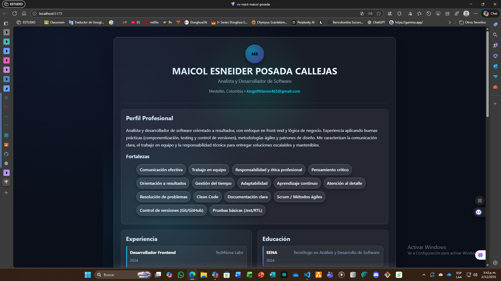
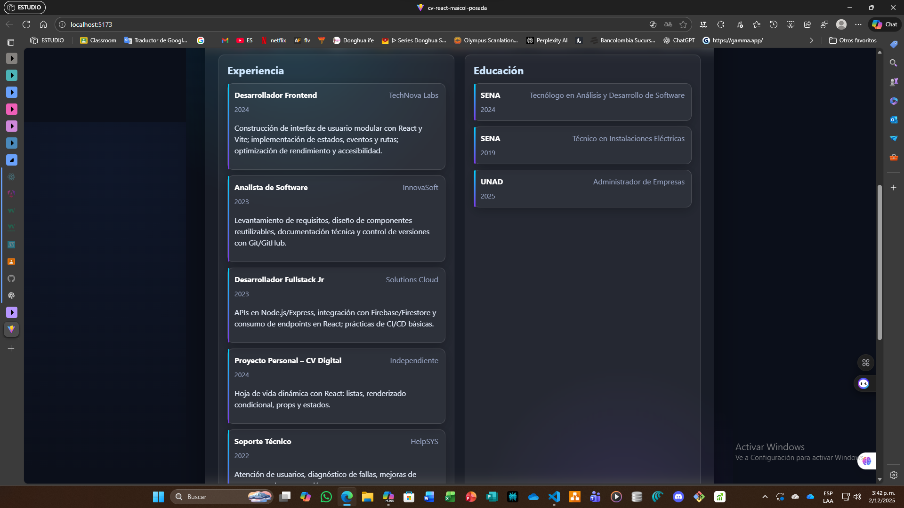
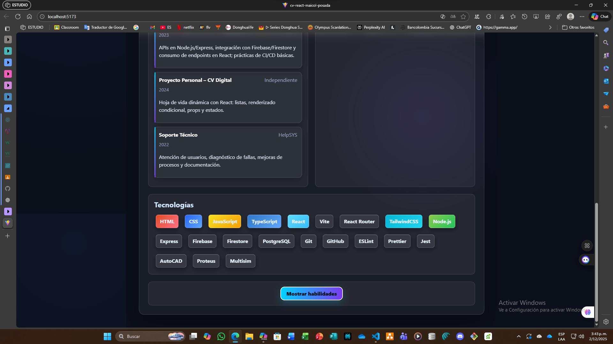
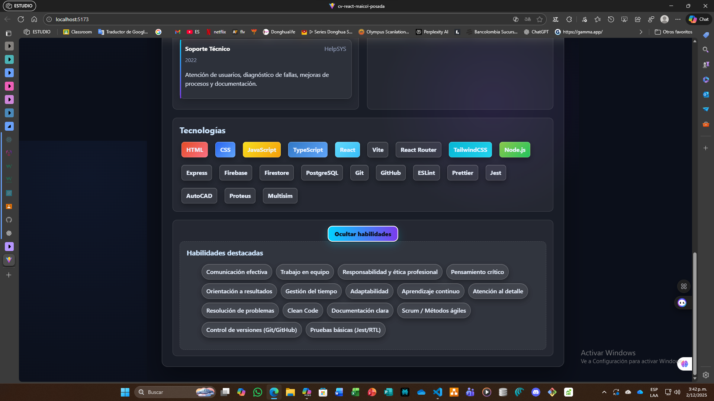

# CV React – Evidencia EV09

**Actividad:** GA1-220501096-03-AA1-EV09  
**Tema:** Actualización de datos, organización del diseño y optimización del proyecto  
**Aprendiz:** Maicol Esneider Posada Callejas  
**Programa:** ADSO – SENA  

---

## Descripción de la Evidencia

En esta evidencia se realizó una **actualización integral del proyecto de Hoja de Vida en React**, enfocada en:

- **Incorporación de datos reales y inventados completos** en el archivo `cvData.js` (nombre, cargo, ciudad, correo, perfil profesional, experiencias, estudios, habilidades y tecnologías).
- **Rediseño visual completo** para lograr una interfaz moderna, profesional y atractiva, aplicando:
  - Estilo **futurista** con glassmorphism, gradientes y efectos visuales.
  - Paleta de colores oscuros con acentos neón.
  - Tipografía clara y jerarquía visual adecuada.
- **Optimización de la estructura del proyecto**:
  - Organización semántica en `App.jsx` con secciones bien definidas.
  - Uso de **Flexbox y Grid** para un layout responsivo.
  - Ajustes en `index.css` para centrar el contenido y eliminar bordes blancos.
- **Responsividad completa** para dispositivos móviles y tablets.
- **Eliminación del componente `FormularioTecnologia.jsx`**:
  - Se consideró que **no era necesario para una hoja de vida profesional**.
  - No cumplía con la guía del proyecto, ya que la funcionalidad de agregar tecnologías dinámicamente no aporta valor en este contexto.
  - Se priorizó la simplicidad y la presentación estática, que es lo esperado en un CV digital.

---

## Cambios Implementados

### 1. Actualización de Datos
- Se completó el archivo `cvData.js` con información real, inventada y coherente:
  - **Datos personales**: nombre, cargo, ubicación y correo.
  - **Perfil profesional**: descripción breve y profesional.
  - **Experiencias laborales**: roles, empresas, periodos y descripciones.
  - **Educación**: instituciones, cursos y años.
  - **Habilidades**: soft skills y prácticas más valoradas por las empresas.
  - **Tecnologías**: herramientas y lenguajes relevantes según los estudios.

### 2. Rediseño Visual
- Se aplicó un diseño **moderno y futurista**:
  - Fondo con gradientes radiales y efectos de luz.
  - Contenedor principal con **glassmorphism** (transparencia + blur).
  - Tarjetas para experiencia y educación con líneas de acento.
  - Chips estilizados para tecnologías y habilidades.
  - Botón principal con gradiente y sombra para interacción.

### 3. Organización del Código
- `App.jsx` reorganizado con estructura semántica:
  - Cabecera, perfil, experiencia, educación, tecnologías y habilidades.
- Componentes (`CabeceraCV`, `Perfil`, `Experiencia`, `Educacion`, `StackTecnologias`, `ToggleHabilidades`, `Habilidades`) optimizados para recibir props y mostrar datos dinámicos.
- Eliminación de código innecesario y simplificación de lógica.

### 4. Responsividad
- Ajustes en `index.css`:
  - Centrado horizontal y vertical opcional.
  - Adaptación de tipografía y espaciado para pantallas pequeñas.
  - Grid dinámico para secciones (experiencia y educación).

---

## Instrucciones para Ejecutar el Proyecto

```bash
# 1. Instalar dependencias
npm install

# 2. Ejecutar el proyecto
npm run dev
```

**Abrir en el navegador:**  
<http://localhost:5173/>

***

## Capturas de la Evidencia EV09

**Diseño futurista centrado y responsivo:** 









***

## Conclusión de la EV09

La actualización realizada en EV09 permitió transformar el proyecto en una **hoja de vida digital profesional, moderna y responsiva**, cumpliendo con los siguientes objetivos:

*   Presentación clara y atractiva de la información.
*   Diseño coherente con tendencias actuales (glassmorphism y gradientes).
*   Eliminación de funcionalidades innecesarias para mantener la simplicidad y cumplir con la guía.
*   Preparación del proyecto para ser publicado como portafolio personal.

Este trabajo consolida las evidencias anteriores y marca el cierre de la fase inicial del CV digital, listo para ser compartido en entornos profesionales.

***

